## GCP Connection

## Databases

## Tables

## DDL Commands
~~~sql
CREATE TABLE DistrictGovernment (
	districtName VARCHAR(255) NOT NULL,
	currentParty VARCHAR(255) NOT NULL,
	representativeName VARCHAR(255) NOT NULL,
	PRIMARY KEY(districtName)
);

CREATE TABLE CircuitJudicial(
	recordID INT NOT NULL AUTO_INCREMENT,
	circuitID INT NOT NULL,
	year INT NOT NULL,
	filings INT,
	charges INT NOT NULL,
	acquittals INT NOT NULL,
	pleas INT NOT NULL,
	convictions INT NOT NULL,
	juryTrialRates FLOAT NOT NULL,
	PRIMARY KEY(recordID)
); 	
~~~

~~~sql
CREATE TABLE CountyDemographics (
    countyName VARCHAR(255) NOT NULL, 
    districtName VARCHAR(255) NOT NULL,
    circuitID INT NOT NULL, 
    population INT NOT NULL, 
    populationDensity FLOAT NOT NULL, 
    medianIncome INT, 
    percentWhite FLOAT, 
    povertyRate FLOAT, 
    literacyScore INT, 
    PRIMARY KEY(countyName),
    FOREIGN KEY(districtName) 
        REFERENCES DistrictGovernment(districtName) 
        ON DELETE CASCADE
    FOREIGN KEY(circuitID)
        REFERENCES CircuitJudicial(circuitID)
        ON DELETE SET NULL 
);

CREATE TABLE PoliceInfo (
    year INT NOT NULL,
    agencyName VARCHAR(255) NOT NULL,
    countyName VARCHAR(225) NOT NULL, 
    numOfficers INT NOT NULL,
    numOfficersPer1000 FLOAT,
    PRIMARY KEY(year, agencyName),
    FOREIGN KEY(countyName) 
        REFERENCES CountyDemographics(countyName)
        ON DELETE CASCADE
);
~~~
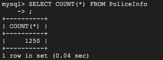
~~~sql
CREATE TABLE CountyArrestRecords (
    recordID INT NOT NULL AUTO_INCREMENT,
    countyName VARCHAR(255) NOT NULL,
    year INT NOT NULL,
    capitalMurder INT NOT NULL,
    violentCrimes INT NOT NULL,
    crimesAgainstPersons INT NOT NULL,
    crimesAgainstProperty INT NOT NULL, 
    drugOffenses INT NOT NULL,
    PRIMARY KEY(recordID, countyName),
    FOREIGN KEY(countyName) 
        REFERENCES CountyDemographics(countyName)
        ON DELETE CASCADE
);
~~~

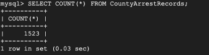

## Advanced Queries 

### Advanced Query #1: Aggregate on High Density Area with a large amount of larceny (Join & Aggregate via GROUP BY & Subquery)

~~~sql
SELECT 
    arrest_records.countyName,
    SUM(arrest_records.crimesAgainstProperty) AS totalCrimesAgainstProperty,
    county.medianIncome,
    county.populationDensity
FROM 
    CountyArrestRecords AS arrest_records
JOIN
    CountyDemographics county ON arrest_records.countyName = county.countyName
WHERE
    county.populationDensity > 350 AND arrest_records.crimesAgainstProperty >
    (SELECT
        AVG(crimesAgainstProperty)
    FROM
        CountyArrestRecords) 
GROUP BY 
    arrest_records.countyName
~~~

#### First 15 Rows
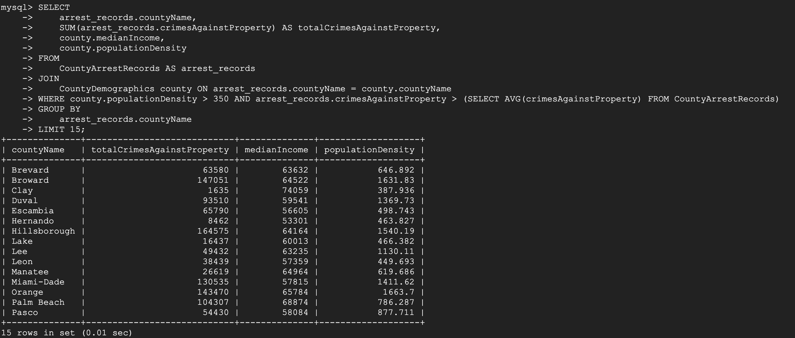
#### Configurations

Default Configuration: No Added Indexes 
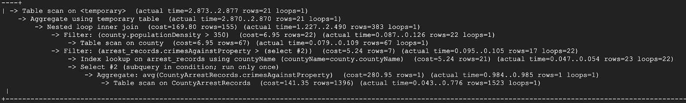

Configuration 1: Index on PopulationDensity
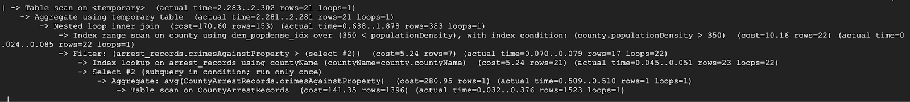

The index on PopulationDensity was added because it is used in the where clause. Our assumption was that by indexing an attribute in the where clause the cost of the filter operation would go down. It did reduce the table scans. However, the cost of the query overall increased by 1 to 170.60 instead of 169.80. 

Configuration 2: Index on CrimesAgainstProperty 
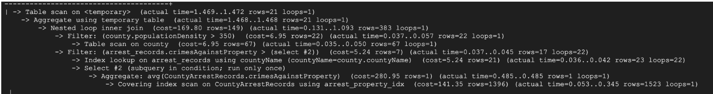

The index on CrimesAgainstProperty was added because it is used in the where clause. However, the cost did not change from the default index since the operation did not change. The filter did not remove a table scan since there was no table scan to begin with. 

Configuration 3: Index on CrimesAgainstProperty & PopulationDensity
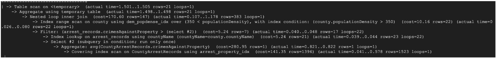

The index on both CrimesAgainstProperty and PopulationDensity was added since adding two indices may improve the cost. However, the cost remained the same as when the populationDensity Index was added. 

#### Final Configuration Choice
The final configuration that we chose is to have no added indices besides the default indices in mysql. This is because there is no cost benefit to the three other indexes we tried and the PopulationDensity index actually decreased index performance. The reduction in table scans seemed to harm query performance. The best overall cost that we achieved was 169.80. 

### Advanced Query #2: Aggregate Filings & Convictions on Circuit Judicial table to divide to get verdict percent (Subquery & Join)

~~~sql
SELECT 
    circuit.circuitID,
    circuit.year,
    county.districtName,
    TotalCharges,
    TotalConvictions,
    (TotalConvictions / TotalCharges) * 100 AS VerdictPercentage
FROM
    (SELECT 
        circuitID, 
        year, 
        SUM(charges) AS TotalCharges, 
        SUM(convictions) AS TotalConvictions
    FROM 
        CircuitJudicial
    GROUP BY 
        circuitID, year) AS circuit
JOIN 
    CountyDemographics AS county ON circuit.circuitID = county.circuitID
ORDER BY 
    circuit.circuitID, circuit.year
~~~
#### First 15 Rows
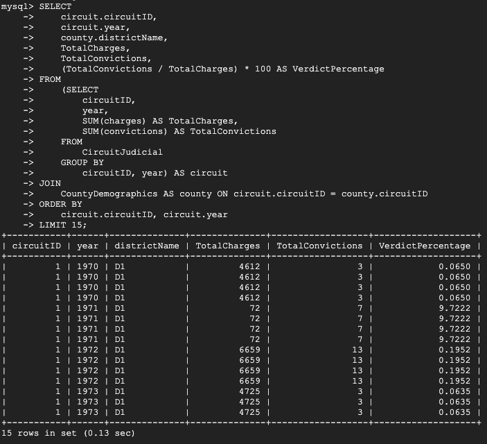
#### Configurations

Default Configuration: No Added Indexes 
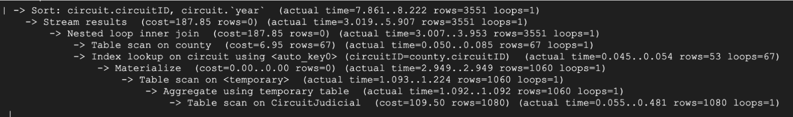

Configuration 1: Index on Year
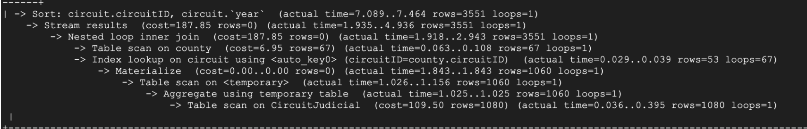

We added an index on Year because it is included in the group by clause for the subquery. However, the cost remained the same as the default configuration. The index did not reduce any table scans. 

Configuration 2: Index on CircuitID 
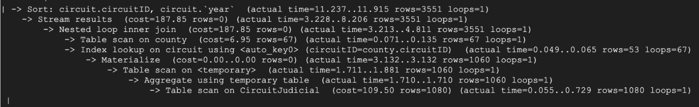

We added an index on CircuitID because it is included in the group by clause for the query and subequery. However, the cost remained the same as the default configuration. 

Configuration 3: Index on CircuitID & Year
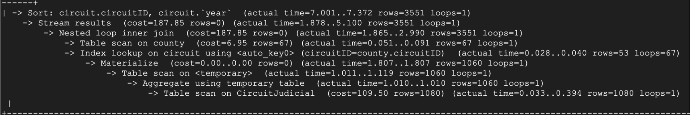

We added an index on both to see if there would be a cost difference when two attributes are indexed. However, this did not reduce any table scans since the table scan was happening in the temporary table. 

#### Final Configuration Choice
The final configuration we chose was the default configuration because there was no added benefit to the Year or CircuitID indices. Since the table scan is happening within the temporary table we could not find an index that improved its performance. The table scan on circuitId did not improve performance either in the circuit or county table. The final cost was 187.85 with the majority of the cost coming from the table scan on CircuitJudicial which was 109.50.

### Advanced Query #3: List all counties' stats where the current district government party is Republican or the population density is greater than 500, and the average median income is greater than $50,000 (Aggregation via GROUP BY & Join)

~~~sql
SELECT 
    cd.countyName, 
    cd.districtName,
    cd.circuitID,
    AVG(cd.population) AS avg_population,
    AVG(cd.populationDensity) AS avg_population_density,
    AVG(cd.medianIncome) AS avg_median_income,
    AVG(cd.percentWhite) AS avg_percent_white,
    AVG(cd.povertyRate) AS avg_poverty_rate,
    AVG(cd.literacyScore) AS avg_literacy_score
FROM 
    CountyDemographics cd
JOIN
    DistrictGovernment dg ON cd.districtName = dg.districtName
WHERE
    dg.currentParty = 'Republican' OR cd.populationDensity > 500
GROUP BY
    cd.countyName, 
    cd.districtName,
    cd.circuitID
HAVING
    AVG(cd.medianIncome) > 60000
~~~
#### First 15 Rows
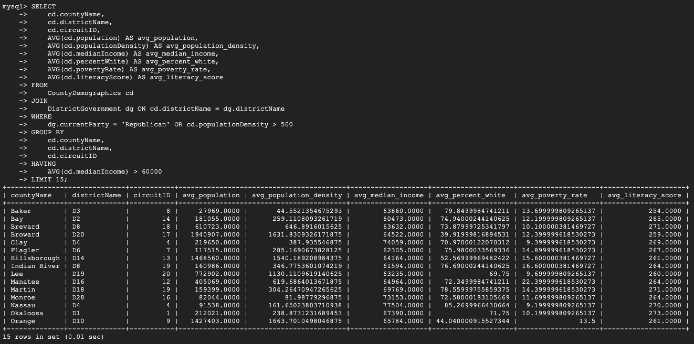
#### Configurations

Default Configuration: No Added Indexes

Configuration 1: Index on Party

We included an index on the political party because it is included in the where clause. However, adding this index had no effect on the overall cost of the query without indexes. 

Configuration 2: Index on Population Density
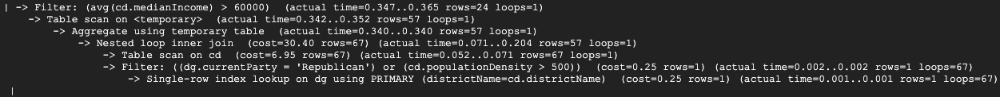
We included an index on the population density because it is also included in the where clause but again the addition of the index did not affect the cost from the default configuration.

Configuration 3: Index on Party & Population Density
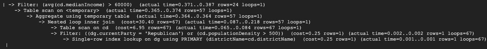
We expected using an index on both the political party and population density may result in reduction in cost but once again the cost remained the same as when no indexes were used.

#### Final Configuration Choice
The final configuration we chose was the default configuration because there was no reduction in cost to adding indexes to the currentParty nor populationDensity attributes. The table scan performance retained its value across all indexing configurations, displaying an overall cost of 30.40 with the largest displayed sub-cost being the table scan with a cost of 6.95. Therefore adding indices would add unnecessary overhead to the table. 

### Advanced Query #4: Details a county's criminal actviity using the poverty rate and the presence of local police officers using aggregation (Aggregation via GROUP BY & Join & Subquery)

~~~sql
SELECT
    cd.countyName,
    cd.districtName,
    cd.circuitID,
    AVG(pi.numOfficersPer1000) AS avg_officers_per_1000,
    MAX(pi.numOfficers) AS max_officers,
    AVG(cd.povertyRate) AS avg_poverty_rate,
    AVG(cd.literacyScore) AS avg_literacy_score
FROM
    CountyDemographics cd
JOIN
    PoliceInfo pi ON cd.countyName = pi.countyName
GROUP BY
    cd.countyName,
    cd.districtName,
    cd.circuitID
HAVING
    AVG(pi.numOfficersPer1000) < 10
    AND AVG(cd.povertyRate) > 15
~~~
#### First 15 Rows
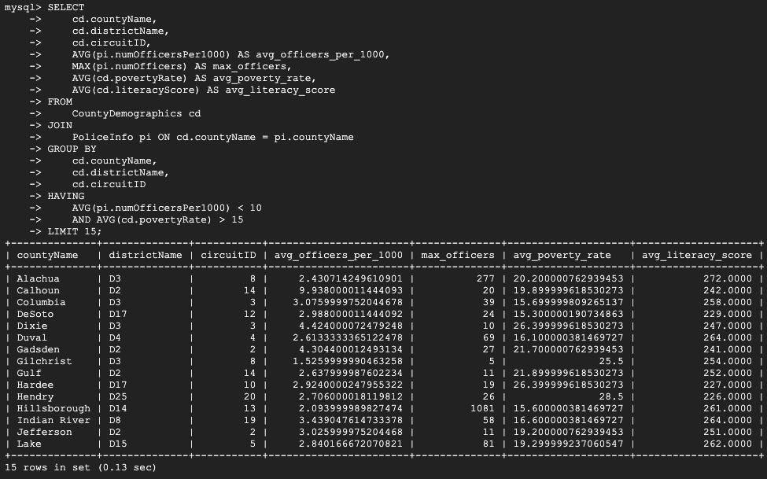
#### Configurations

Default Configuration: No Added Indexes
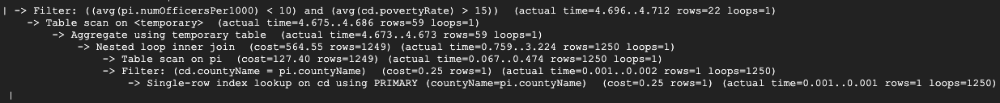

Config 1: Index on Officers Per 1000
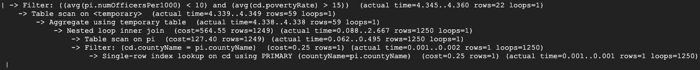
We added an index on the numOfficersPer1000 attribute as it was included in the query's having clause. However, this index did not seem to have any effect on the cost from the default configuration.

Config 2: Index on Poverty Rate
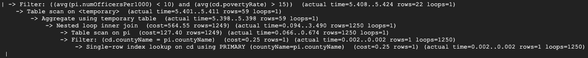
We added an index on the povertRate attribute as it was included in the query's having clause as well. Again, creating this index did not change the resulting cost.

Config 3: Index on Both
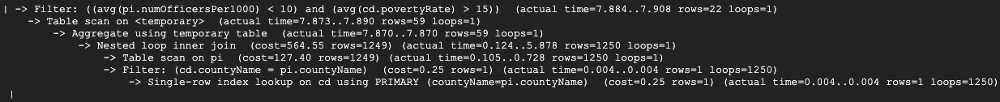
After creating the previous two indexes on their corresponding attributes to test if they could both reduce cost, there again was no effect on the overall cost of the query.

#### Final Configuration Choice
Since none of the indexing configuration strategies yielded lower query costs, we chose the default configuration as the best choice. Therefore, adding extra indexes to the tables' attributes did not change the cost or the indexing performance of the query beyond the default indexing configuration. The cost was borne by looking at policeInfo.countyName which was not indexed. The overall cost and the table scan costs were 564.55 and 127.4 respectively, with the table scan contributing the most to the overall cost. 
