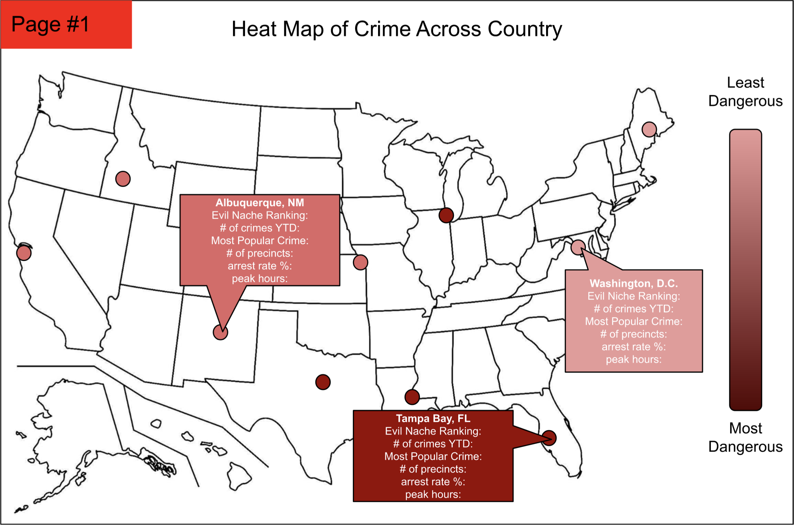
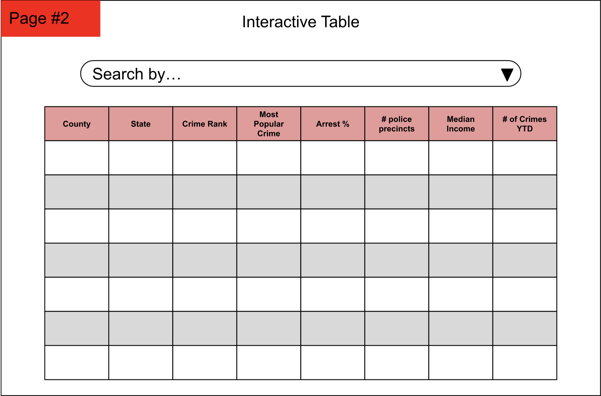
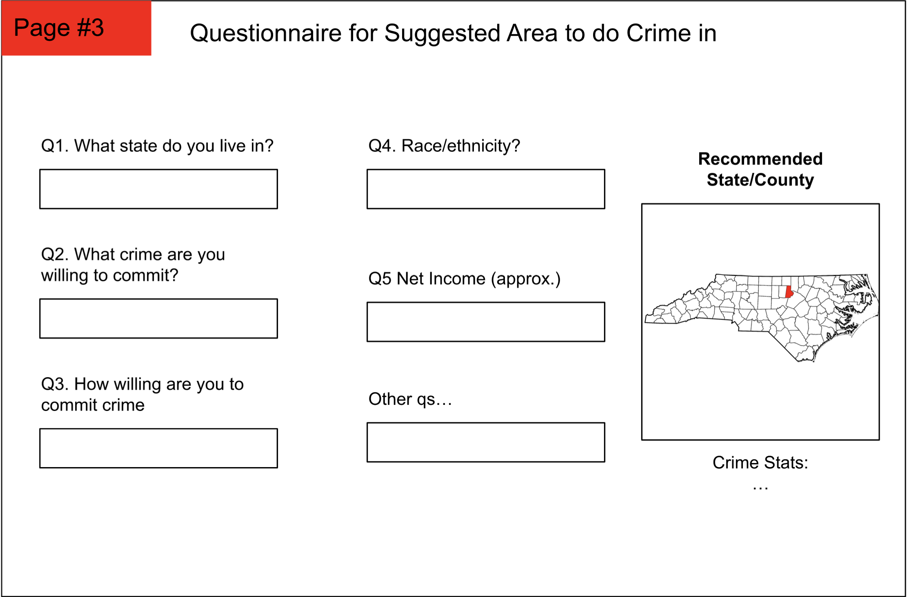

# Evil Niche

## Project Summary
Like what our title says, we want to unveil the most crime-ridden counties/communities in Florida and other regions of the United States. The project will take in county data and determine what are the best places to commit certain kinds of crimes such as larceny or homicide. It will also indicate different features of each county that make it beneficial for would-be criminals to commit their crime of choice there. The project will provide a visual view of the cities.

## Description
There is a serious lack of information about the weak points of law enforcement. There are many areas across the country where it is easy to get away with certain types of crime. We want to give people the ability to input their desired crime (along with any supported supplemental data such as demographics) and it tells them what is the best place to commit that crime. We define the “best place” as the place that provides the lowest chance of them getting caught. Through this application, we offer data to advise local governments, police departments, and the general denizens of an area. It helps people understand the weak spots in their local community. 

### Creative Component
We would create a heatmap of crime hotspots and low spots to indicate the places with the least and most amount of crimes. The map can also indicate the efficacy of police in the area so there is multilayered  information about how easy it is to commit a crime in a certain area. 
We will achieve this through pulling the crime rate data per county from our database and converting it into color values based on the size relative to the max amount of crime in any county. Furthermore the police precinct data can be pulled from a separate database and it can show how many police officers there are in each county. 

### Usefulness
On a basic level, users should be able to easily navigate our website through a clean UI that clearly shows options to either get a specific location given criteria or get general information about trends and patterns through visualized data. In order to fulfill the first criteria, the website must support text input that accepts a user’s input. We want to include a recommender system using the data provided in the datasets we describe below. A user should be able to easily input pieces of information such as crime type, demographic information, and more, and receive a location that is ideal for the crime they require. A recommender system is more complicated than simple querying as it requires learning from past user interactions and their feedback on location recommendations. For the second criteria, we aim to include visualizations for our datasets, whether that be graphs or maps, so that users who may not want a specific location can still understand general patterns. These visualizations should be dynamic to support user querying within the graphs, such as if users want to hone in on certain areas, time periods, or crimes. There are websites that are crime maps that have some similarities to our application, such as https://spotcrime.com/map, in that they also track crime and factors that play into crimes being committed. However, these websites differ from our application in that they are purely informative and do not integrate any sort of recommender system that is personalized to users based on user inquiry. 

### Realness
We have two initial datasets. The first dataset is from the Florida Department of Law Enforcement which indicates the offense data. This dataset format is in an xlsx. The degree of the data is 22 whereas the cardinality is 683 rows. The data source describes the amount of reported crimes and the amount of those crimes that have had a perpetrator arrested and identified. It also describes the crime rate per 100,000. The second dataset is also from the Florida Department from Law and describes the arrest data. The degree of the data is 34 whereas the cardinality is 70. The data source describes the amount of people arrested for each crime by county as well as the total arrests split into adult and juvenile arrests. These two datasets split their data by county so our project can find the best counties to commit crimes in (and conversely, the counties that need the most support to stop crime). 

### Functionality
#### Personal Tables
* Create: Users can create their own personal tables that track statistics for specific counties that they are interested in. 
    * Users can add more data from Florida to personal tables or the global table. 
* Update: they can update their personal tables with new data that they find
* Delete: Users can delete from their personal tables
* Read: Users can read any of the data on the website to find more information about the city
#### Crime Recommender
* It will be a search box with a multi-step questionnaire. 
* Users can search for specific crimes using keyword search or dropdown 
* The recommendation system will also search for precinct data as well as crime data for various counties. 
* The recommender will output a list of counties to commit that crime in.
#### County View
This is a heatmap that indicates counties that are hotspots for certain crimes. It is a way for individuals to quickly glance at nearby counties that they can commit a crime in. The heatmap also provides information on each city such as the amount of precincts and its crime to arrest ratio. The goal of the heatmap is a visual indication of the danger level of each county for a criminal. 

## Mockup

## Project Work Distribution
In distributing project work for both the frontend and backend components, our team has carefully assigned tasks to individuals based on their expertise and experience. For the Heat Map and interactive table development, Sahith and Numair, recognized for their proficiency in UI design, have been tasked with creating the user interface components. Meanwhile, Ayush and Kajal are spearheading the backend systems, leveraging their skills in data retrieval and database management to collect crime datasets from diverse states and establish the necessary database systems. By strategically aligning responsibilities with each team member's strengths, we aim to optimize efficiency and ensure the successful execution of both frontend and backend tasks, ultimately leading to the fulfillment of project objectives.